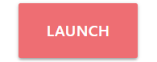
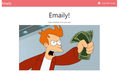
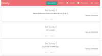
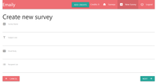

<h1 align="center">Emaily</h1>

<div align="center">
  <sub>Collecting feedback done right. Period.</sub>
</div>

<br/>


<div align="center">
  <a href="https://still-tundra-72245.herokuapp.com"></a>
</div>

## Description
<div align="center">
  Lorem ipsum temp short thingy
  <br/>
  <br/>
  
  
  
</div>

## Story
Lorem ipsum temp full thingy
                            
### Local Usage
```
npm install
npm run dev
```

## Inspiration
* [Stephen Grider](https://www.udemy.com/node-with-react-fullstack-web-development/) - Build and deploy fullstack web apps with NodeJS, React, Redux, Express, and MongoDB.

## License
This project is licensed under the MIT License


